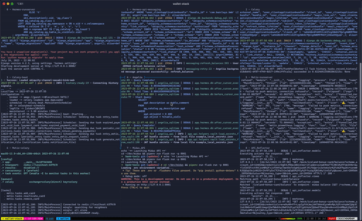

Pre-requisites:
 - [tmux](https://formulae.brew.sh/formula/tmux) version >= 3.3a
 - fzf: [Install via brew](https://github.com/junegunn/fzf#using-homebrew)

## Helper scripts

The helper scripts in this directory are automatically sourced into the
main wallet-stack and retail-stack scripts to start a tmux session, so
shouldn't need to do anything to 'install' these.

Currently there is two tmux helper scripts:
    - tmux-pane-menu, switch between tmux panes with keybinds
    - tmux-session-menu, switch tmux sessions with keybinds

Usage:

As an example, for the `run-wallet-stack.sh`, default keybind is <prefix> Ctrl-l
to the tmux-pane-menu script. The prefix is Ctrl-b by default on tmux.

In short, pressing Ctrl-b, then Ctrl-l will open a menu to switch between
tmux panes (See below)

